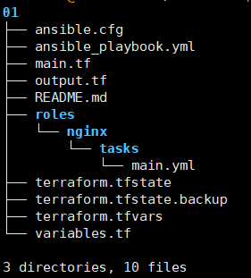
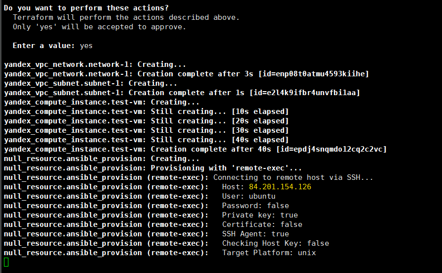
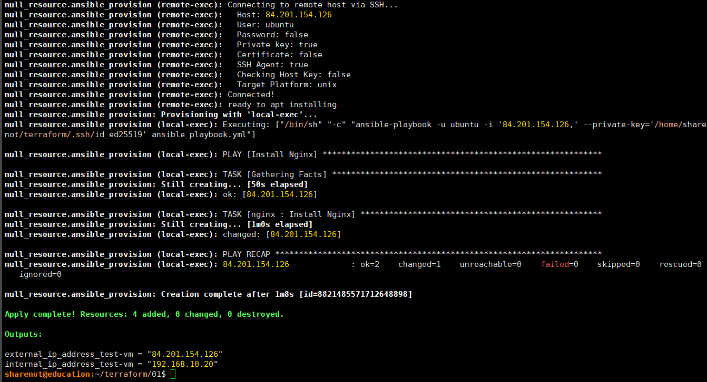
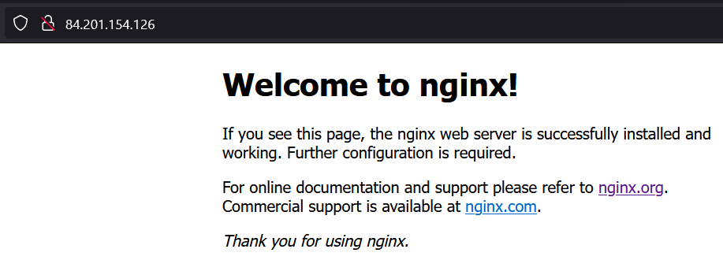

# Деплой виртуальный машины с последующей установкой nginx

## Описание:
Манифест позволяет развернуть виртуальныу мвшину в Яндекс-облаке, с последующим присваиванием внешнего IP и установкой Nginx.  
Для деплоя спользуются terrafom и ansible. Предполагается предварительное получение данных аутентификации в облаке, и их указание в переменных.
Для деплоя спользуются terrafom и ansible.
Используемая структура файлов:


## Требования:

* В системе должен быть формированный публичный и приватный ключ:
```
ssh-keygen -t ed25519 -C username@email.com
```
По умолчанию используются ключи ```~/.ssh/id_ed25519.pub``` и ```~/.ssh/id_ed25519```.  
Возможно указание иных ключей в terrafom.tfvars.

* В системе должны быть установлены ansible и terraform. Тестировалось на версиях:
	+ ansible 2.10.8
	+ terraform v1.6.3
* В системе должна быть установлена утилита yc (YandexCloud) для формирования токена

## Настройка и запуск:

### Для указания переменных необходимо создать файл terrafom.tfvars.

#### Обязательные переменные:
* cloud_id - ID облака, в котором будет развёрнута ВМ
* folder_id - ID директории , в котором будет развёрнута ВМ
* token_iam - IAM-токен, полученный для аутентификации в облаке. Перезапросы токена можно выполнять командой ```yc iam create-token```

#### Необязательные переменные:
* network_name - имя создаваемой сети. По умолчанию tf-testnetwork
* instance_name -имя создаваемой ВМ. По умолчанию test.vm
* image_id - образ для ВМ. По умолчанию ubuntu 22.04
* username - создаваемый на ВМ пользователь. По умолчанию ubuntu
* ssh-priv-key - приватный ключ для подключения к ВМ
* ssh-pub-key - публичный ключ для подключения к ВМ

#### Пример файла:
```
#=========== main =================
cloud_id  = "b1gxxxxxxxxxxxxxxx2h"
folder_id = "b1xxxxxxxxxxxxxxxxa0"
token_iam = "t1.xxxxlongtokenvaluexxxxAg"

#=========== network ==============
network_name = "tf-testnetwork"

#=========== instance =============
instance_name = "test-vm"
image_id      = "fd8m3j9ott9u69hks0gg"
ssh-priv-key = "/home/user/terraform-project/.ssh/id_ed25519"
ssh-pub-key = "/home/user/terraform-project/.ssh/id_ed25519.pub"
```

### Для запуска:
* склонировать репозиторий;
* настроить подключение к облаку яндекс, получить токен;
* указать токен и другие необходимые переменные в terrafom.tfvars
* инициализировать terrafom: ```terraform init```
* сформировать и проверить план деплоя: ```terraform plan```
* запустить деплой: ```terraform apply```  
Необходимо подтвердить выполнение, после чего будет запущено создание ВМ:  
  

* После завершения деплоя, будут выведены IP-адреса созданной ВМ:  
  

Для проверки выполнить http-запрос на IP, сформированный после деплоя:
  

